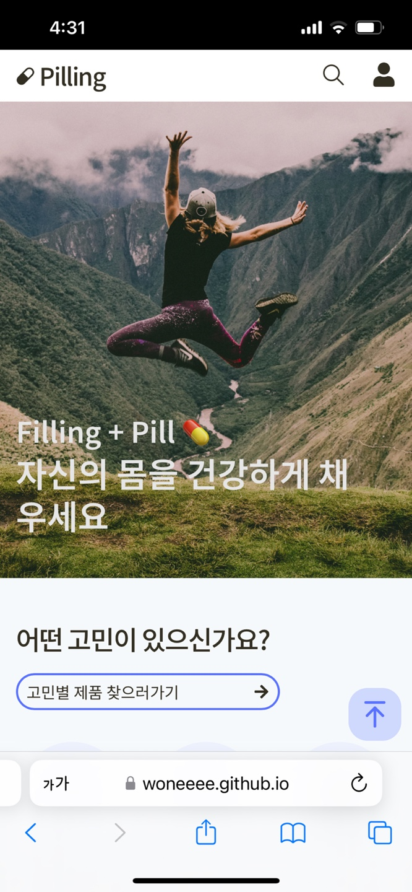
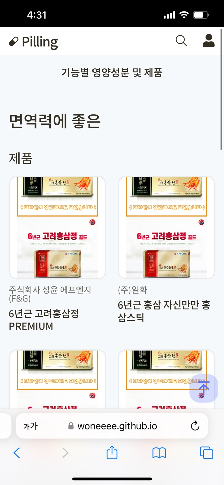
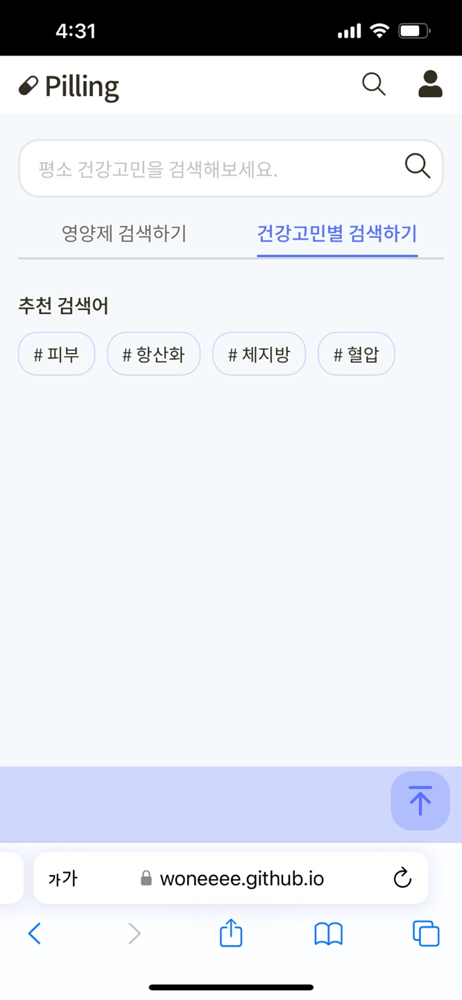
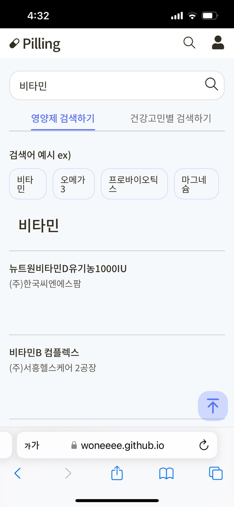
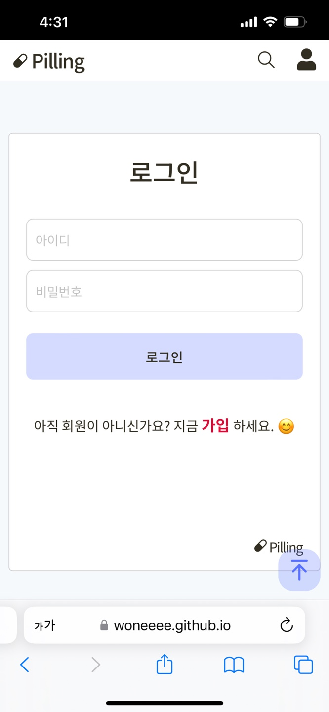

# Pilling | Filling + Pill 💊

## 목적성

- 요즘 젊은 세대는 ‘셀프메디케이션’이라고 하여 스스로의 건강을 챙기기위해 다양한 노력을 합니다. 저 또한 부족한 영양소를 보충하기위해 비타민, 유산균 등을 챙겨먹고 있는데 많은 제품 중 어떤 제품을 선택할지 많은 고민을 했던 것 같습니다.

- 따라서 저는 사용자의 건강 고민에 맞게 필요한 영양성분 및 건강보조제를 소개 및 추천해주는 앱이 있었으면 좋겠다고 생각했습니다.

- 건강보조제의 복용방법, 1일 섭취량, 기능성 효과, 주의사항 등의 정보를 주어 구매전 참고할 수 있게 하여 저는 소비자가 스스로에게 맞는 제품을 찾게 해주고 효율적인 소비를 돕기위해 Pilling 앱을 제작하게 되었습니다.

## Stack

  
   

- React
- HTML / CSS
- JS
- Node.js
- Git / GitHub

## 개발기간 및 계획표

## 프로젝트소개 및 URL

- GitHub URL - https://github.com/Woneeee/Pilling
- Project URL - https://woneeee.github.io/Pilling/

- 공공데이터 Open Api URL

  - 식품의약처
    - https://www.data.go.kr/tcs/dss/selectApiDataDetailView.do?publicDataPk=15056760
    - https://www.data.go.kr/data/15059798/openapi.do

- 모바일 이미지

  
  
  
  
  

## 프로젝트를 하며 느낀점

### 프로젝트 진행 중 겪은 어려움

1.

2.

### 어려움을 해결한 방안

1.
2.

## 프로젝트를 하면서 알게된 내용

## 프로젝트 진행중 칭찬 및 반성

## 앞으로의 개발 방향
